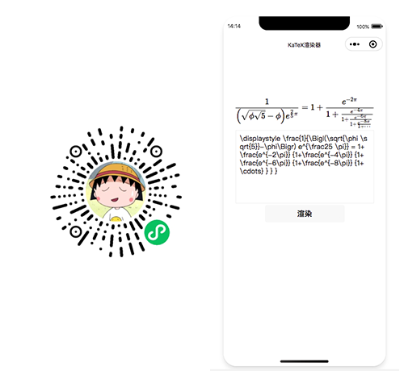

# katex-weapp

基于 KaTeX 构建的小程序原生 LaTeX 渲染组件（不依赖服务端渲染）

## 效果预览图



## 实现原理

基于 katex 库，解析 latex 公式生成虚拟 dom 树对象，将 dom 对象翻译成小程序的 rich-text 支持的 nodes 由小程序渲染

### 局限性

- 依赖微信小程序的 `rich-text` 组件渲染，请注意小程序基础库 1.4.0 开始支持
- 由于 katex 库过大会大量占用小程序包体大小。

### 包体过大解决方式

- 【推荐】使用小程序分包：[小程序分包文档](https://developers.weixin.qq.com/miniprogram/dev/framework/subpackages.html)
- 【不推荐】如果你希望再小一点，可以将解析模块放在服务端，提供解析接口，再将结果展示在 rich-text 中（已实现）`虽然这里使用了服务端，但是这里是产出json格式的nodes而非图片，相对于将latex转为图片的方案也好很多`

## 有没有完整题目编排方案？

- DSlate 富文本编辑器：[DEMO](https://rojer95.github.io/dslate/getting-started/math)

## 如何使用？

### 在原生小程序项目中直接使用

#### 1. 在小程序中安装依赖

```bash
npm install @rojer/katex-mini
```

#### 2. 在小程序开发者工具中 - 工具 - 构建 npm，执行后会看到生成的`miniprogram_npm`目录

#### 3. 在 `app.wxss` 加载 katex 的内置 css 样式

```less
@import "./miniprogram_npm/@rojer/katex-mini/index.wxss";
```

#### 4. 在小程序中解析 latex

```js
// index.js
import parse from "@rojer/katex-mini";

Page({
  data: {
    nodes: [],
    latex:
      "\\displaystyle \\frac{1}{\\Bigl(\\sqrt{\\phi \\sqrt{5}}-\\phi\\Bigr) e^{\\frac25 \\pi}} = 1+\\frac{e^{-2\\pi}} {1+\\frac{e^{-4\\pi}} {1+\\frac{e^{-6\\pi}} {1+\\frac{e^{-8\\pi}} {1+\\cdots} } } }",
  },

  onInput: function (e) {
    this.setData({
      latex: e.detail.value,
    });
  },

  renderLatex: function () {
    const katexOption = {
      displayMode: true,
    }; // 参考 katex 的配置
    this.setData({
      nodes: parse(this.data.latex, {
        throwError: true, // 为true时，解析失败会抛出错误，否则会直接把错误信息解析为nodes结构展示
        ...katexOption,
      }),
    });
  },
});
```

#### 5. 在页面中展示

```html
<!--index.wxml-->
<view class="container">
  <rich-text nodes="{{nodes}}"></rich-text>
  <textarea value="{{latex}}" bindinput="onInput" maxlength="1400"></textarea>
  <button bindtap="renderLatex">渲染</button>
</view>
```

### 在 Taro 中直接使用

#### 1、clone 项目

```bash
git clone https://github.com/rojer95/katex-mini-taro-demo.git
```

#### 2、项目根目录安装依赖

```bash
yarn
```

#### 3、编译

```bash
yarn dev:weapp
```

#### 4、编译后:

- 打开小程序开发者工具, 打开 dist 目录
- 可以修改文本框内容 Latex 公式，点击渲染查看效果

### 使用 API 调用方式

> API 的 Demo 源码: [https://github.com/rojer95/katex-mini-api](https://github.com/rojer95/katex-mini-api)

#### 1、导入 wxss

```less
// 在app.wxss中
@import "katex-mini.wxss";
```

> `katex-mini.wxss` 的下载地址： [https://cdn.jsdelivr.net/npm/@rojer/katex-mini/dist/index.wxss](https://cdn.jsdelivr.net/npm/@rojer/katex-mini/dist/index.wxss)

#### 2、请求接口

```javascript
wx.request({
  url: "https://katex-mini-api.vercel.app",
  data: {
    latex: "a=b+c",
  },
  dataType: "json",
  success(res) {
    this.setData({
      nodes: res.data,
    });
  },
});
```

#### 3、放到 RichText 组件里

```html
<rich-text nodes="{{ nodes }}" />
```

### 贡献者 ✨

<table>
<tr>
    <td align="center">
      <a href="https://github.com/rojer95">
        
        <br />
        <sub><b>rojer</b></sub>
      </a>
    </td>
    <td align="center">
      <a href="https://github.com/had0ngzhu">
        
        <br />
        <sub><b>had0ngzhu</b></sub>
      </a>
    </td>
  </tr>
</table>

### 写在最后

> 如果能帮到你，希望能给我一个[Star](https://github.com/rojer95/katex-mini)。感谢！
